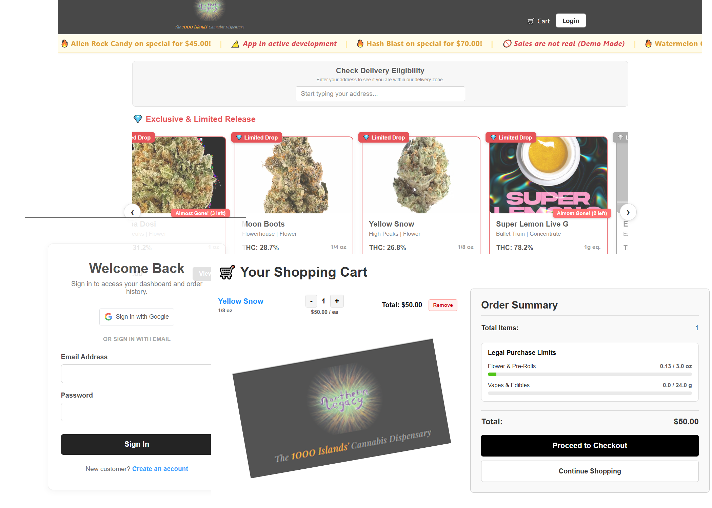

Northern Legacy is a licensed microbusiness dispensing cannabis products in the 1000 Islands region of Upstate New York. Built on the MERN stack, this platform acts as a custom, vertically integrated regulatory gatekeeper, enabling fully compliant e-commerce ordering for both **Mainland (Land)** and soon to be implemented **Maritime (Water)** delivery.

Built to handle the extreme geographic complexity of the St. Lawrence River border region, the system enforces strict geofencing, dynamic delivery clustering, and real-time state compliance limits.

---

## 🚀 Current Implemented Features

* **🛒 Dynamic Cart & Compliance Engine:** Global state management via Zustand that calculates real-time New York State legal purchase limits (3.0 oz flower / 24.0 g concentrates) and blocks checkout if limits or inventory maximums are exceeded.
* **🗺️ Border-Zone Geofencing:** Integrates Google Maps Places & Geometry APIs to enforce a strict 25-mile delivery radius while actively detecting and blocking addresses that cross the international boundary into Canada.
* **🚤 Anchored Logistics Algorithm:** A custom, first-come-first-served delivery routing system. The first user to book a delivery window drops a geographic "anchor." Subsequent users can only select that time slot if their verified address falls within an 8-mile radius of the anchor, preventing extreme driver routing.
* **💳 Tokenized Payment Vault:** A mocked high-risk payment flow allowing users to securely link and save Digital ACH (Aeropay) or PIN-Debit methods to their user profile, featuring dynamic cashless ATM convenience fees.
* **🔐 The Compliance Gate:** Initial UI scaffolding for mandatory 21+ age gating and profile anonymization/deletion to comply with consumer data privacy laws.
* **📱 Responsive E-Commerce UI:** Fully responsive product grid, fractional weight conversions (e.g., displaying decimal ounces as 1/8 oz or 1/4 oz), and QR-code receipt generation for secure in-person handoffs.

---

## 🛣️ Development Roadmap (Coming Soon)

* **Admin Dispatch Dashboard:** A centralized portal for management to view active orders and visualize the generated delivery routes.
* **Offline-First Driver PWA:** A Progressive Web App for drivers equipped with dual-scan (QR + 2D Barcode) electronic signature capture and ID verification.
* **Metrc API Integration:** Automated, bi-directional syncing for incoming wholesale manifests and real-time outbound sales receipts.

---

## 🛠️ Tech Stack

**Frontend:**
* React.js (v18+)
* Vite (Build Tooling)
* Zustand (Global State Management)
* React Router DOM
* Google Maps API (Autocomplete & Spherical Geometry)

**Backend & Database:**
* Node.js & Express.js
* MongoDB Atlas / Mongoose ODM
* JSON Web Tokens (JWT) & bcryptjs (Auth & Security)

---

## 💻 Local Development Setup

To run this application locally, you will need Node.js installed and access to the MongoDB Atlas cluster.

### 1. Clone the Repository
```bash
git clone [https://github.com/hughmorris01/northern_legacy.git](https://github.com/hughmorris01/northern_legacy.git)
cd northern-legacy
```

### 2. Install Dependencies
This project uses a monorepo structure. You must install dependencies for both the frontend and backend.
```bash
# Install backend dependencies
cd backend
npm install

# Install frontend dependencies
cd ../frontend
npm install
```

### 3. Environment Variables
Use `env.example` to create a `.env` file in the root `backend` directory. Do **not** commit this file to version control. 

```text
# /backend/.env
PORT=5000
MONGO_URI=mongodb+srv://<username>:<password>@cluster0...
JWT_SECRET=your_jwt_secret_key
VITE_GOOGLE_MAPS_API_KEY=your_google_maps_key
```

### 4. Start the Development Servers
Open two separate terminal windows or a split terminal.

**Terminal 1 (Backend):**
```bash
cd backend
npm run server
```
*(Server will start on http://localhost:5000)*

**Terminal 2 (Frontend):**
```bash
cd frontend
npm run dev
```
*(Vite UI will start on http://localhost:5173)*

---

## ⚖️ License & Confidentiality
**Proprietary Software.** This source code is the confidential and proprietary property of Excelsior Genetics, LLC. Unauthorized copying, distribution, or modification is strictly prohibited.
