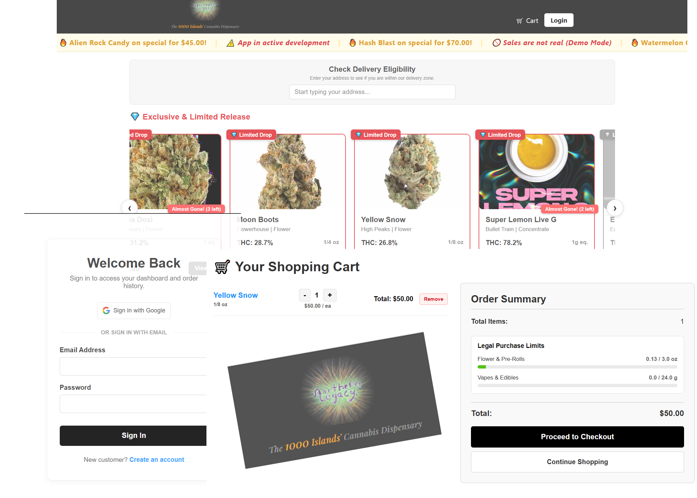

# 🚀 Northern Legacy E-Commerce Portal

[](#)
[](#)
[](#)
[](#)

> **A custom, vertically integrated regulatory gatekeeper and e-commerce platform built to navigate the complex compliance and geographic logistics of cannabis delivery in the 1000 Islands.**

**🌐 Live Site:** [northernlegacyny.com](https://northernlegacyny.com)

---

## 📖 Table of Contents
- [About the Project](#-about-the-project)
- [Key Features](#-key-features)
- [Development Roadmap](#%EF%B8%8F-development-roadmap)
- [Tech Stack & Architecture](#%EF%B8%8F-tech-stack--architecture)
- [Getting Started](#-getting-started)
- [Environment Variables](#-environment-variables)
- [Testing & QA](#-testing--qa)
- [Project Documentation](#-project-documentation)
- [License & Confidentiality](#%EF%B8%8F-license--confidentiality)
- [Contact](#-contact)

---

## 🎯 About the Project

Northern Legacy is a license-pending microbusiness dispensing cannabis products in the 1000 Islands region of Upstate New York. Built on the MERN stack, this platform acts as a custom, vertically integrated regulatory gatekeeper, enabling fully compliant e-commerce ordering for both **Mainland (Land)** and soon to be implemented **Maritime (Water)** delivery.

Built to handle the extreme geographic complexity of the St. Lawrence River border region, the system enforces strict geofencing, dynamic delivery clustering, and real-time state compliance limits.

---

## ✨ Key Features

* **🛒 Dynamic Cart & Compliance Engine:** Global state management via Zustand that calculates real-time New York State legal purchase limits (3.0 oz flower / 24.0 g concentrates) and blocks checkout if limits or inventory maximums are exceeded.
* **🗺️ Border-Zone Geofencing:** Integrates Google Maps Places & Geometry APIs to enforce a strict 30-mile delivery radius while actively detecting and blocking addresses that cross the international boundary into Canada.
* **🚤 Anchored Logistics Algorithm:** A custom, first-come-first-served delivery routing system. The first user to book a delivery window drops a geographic "anchor." Subsequent users can only select that time slot if their verified address falls within an 8-mile radius of the anchor, preventing extreme driver routing.
* **💳 Tokenized Payment Vault:** A mocked high-risk payment flow allowing users to securely link and save Digital ACH (Aeropay) or PIN-Debit methods to their user profile, featuring dynamic cashless ATM convenience fees.
* **🔐 The Compliance Gate:** Initial UI scaffolding for mandatory 21+ age gating and profile anonymization/deletion to comply with consumer data privacy laws.
* **📱 Responsive E-Commerce UI:** Fully responsive product grid, fractional weight conversions (e.g., displaying decimal ounces as 1/8 oz or 1/4 oz), and QR-code receipt generation for secure in-person handoffs.

---

## 🛣️ Development Roadmap 

Development is structured across strategic phases to systematically roll out critical operational pillars:

* **Phase 2: State Compliance (Metrc):** Automated, bi-directional API integration with the NYS Metrc system for real-time outbound sales reporting and incoming wholesale manifest screening.
* **Phase 3: Dispatch & Administration:** Rollout of the **Admin Dashboard** allowing management to view active orders, manage inventory, and visualize delivery routes.
* **Phase 4: In-Store Retail:** Implementation of the **Budtender Portal / POS**, connecting physical storefront sales directly to the centralized inventory and compliance engine.
* **Phase 5: Maritime Expansion:** Integration of **Maritime (Water) Delivery**, enabling dockside drops via Google Plus Codes and dynamic anchor mapping logic.
* **Phase 6: Fleet Operations:** Deployment of the **Offline-First Driver PWA** allowing delivery staff to perform dual-scan handoffs and record GPS telematics offline.

---

## 🛠️ Tech Stack & Architecture

**Frontend:**
* React.js (v18+)
* Vite (Build Tooling)
* Zustand (Global State Management)
* React Router DOM
* Tailwind CSS
* Google Maps API (Autocomplete & Spherical Geometry)

**Backend & Database:**
* Node.js & Express.js
* MongoDB Atlas / Mongoose ODM
* JSON Web Tokens (JWT) & bcryptjs (Auth & Security)

---

## 🚀 Getting Started

To run this application locally, you will need Node.js installed and access to the MongoDB Atlas cluster.

### 1. Clone the Repository
```bash
git clone [https://github.com/hughmorris01/northern_legacy.git](https://github.com/hughmorris01/northern_legacy.git)
cd northern-legacy
```

### 2. Install Dependencies
This project uses a monorepo structure. You must install dependencies for both the frontend and backend.
```bash
# Install backend dependencies
cd backend && npm install

# Install frontend dependencies
cd ../frontend && npm install
```

### 3. Start the Development Servers
Open two separate terminal windows or a split terminal.

```bash
# Terminal 1 (Backend)
cd backend
npm run server
# (Server will start on http://localhost:5000)

# Terminal 2 (Frontend)
cd frontend
npm run dev
# (Vite UI will start on http://localhost:5173)
```

---

## 🔐 Environment Variables

Use `env.example` to create a `.env` file in the root `backend` and `frontend` directories. Do **not** commit these files to version control. 

**Backend (`/backend/.env`)**
```text
PORT=5000
MONGO_URI=mongodb+srv://<username>:<password>@cluster0...
JWT_SECRET=your_jwt_secret_key
GOOGLE_CLIENT_ID=your_google_oauth_client_id
```

**Frontend (`/frontend/.env`)**
```text
VITE_API_URL=http://localhost:5000
VITE_GOOGLE_MAPS_API_KEY=your_google_maps_key
VITE_GOOGLE_CLIENT_ID=your_google_oauth_client_id
```

---

## 🧪 Testing & QA

Quality assurance is strictly integrated into the development lifecycle. 

* **User Acceptance Testing (UAT):** A rigorous manual testing protocol ensures all business constraints (inventory race conditions, geofencing, limits) function flawlessly under simulated real-world scenarios. 

*View the full [UAT Protocol & Evidence](./docs/03-uat-plan.md).*

---

## 📂 Project Documentation

This project follows a strict Software Development Life Cycle (SDLC) tailored for heavily regulated industries. Comprehensive documentation, including the PRD, TDD, and architectural overviews, can be found in the `/docs` directory.

👉 **[View the complete Documentation Guide](./docs/README.md)**

---

## ⚖️ License & Confidentiality
**Proprietary Software.** This source code is the confidential and proprietary property of Excelsior Genetics, LLC. Unauthorized copying, distribution, or modification is strictly prohibited.

---

## 📞 Contact

**Greg Farrell** - Lead Full-Stack Engineer  
📧 **Email:** [greg@exgenetics.com](mailto:greg@exgenetics.com)  
📱 **Phone:** (585) 439-8235  
🔗 **LinkedIn:** [linkedin.com/in/gregory-farrell](https://www.linkedin.com/in/gregory-farrell)

Project Link: [https://github.com/hughmorris01/northern_legacy](https://github.com/hughmorris01/northern_legacy)